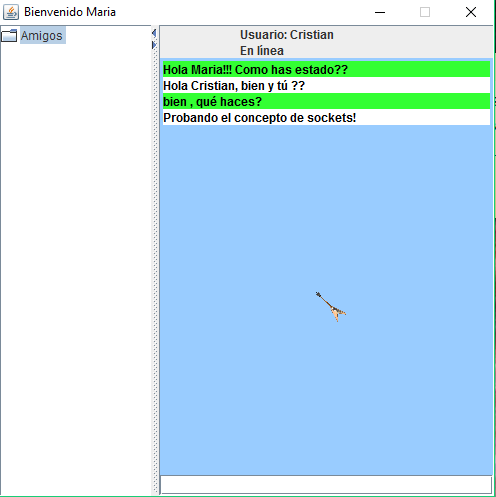
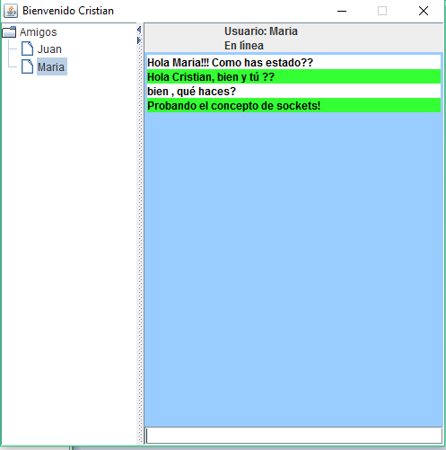

# Simple CHAT

This java project is a simple chat used to learn the concepts about sockets in JAVA.
This project was built in 2015.

# How To Use

Run the **ChatServer** Project as Java Application.  The server will be available to manage the coming message's clients.

Run the **ChatCliente** as Java Application by every client to you want to communicate with the server. 

## Client 1

## Client 2

